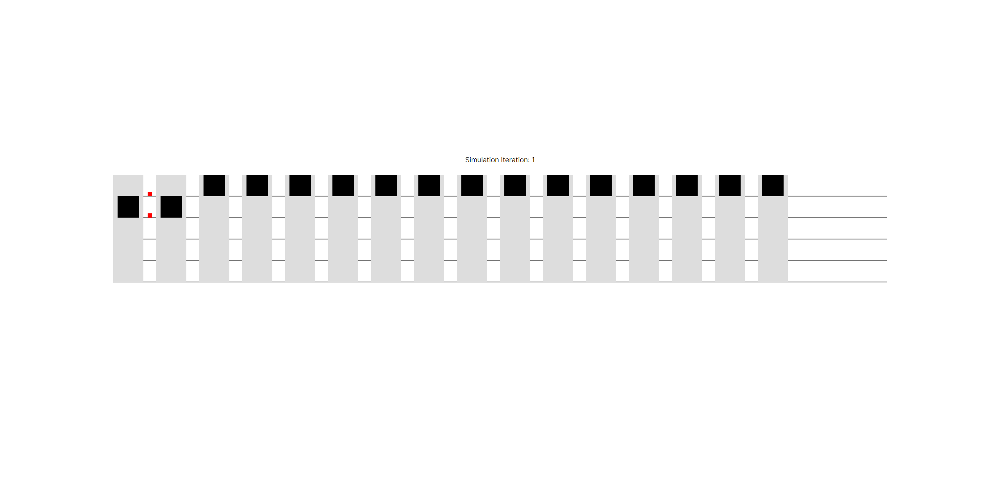

<!-- ABOUT THE PROJECT -->

## About The Project




### Description

This application simulates elevator system that can handle up to 16 elevators using FCFS method to transport agents.

### Built With

- [Next.js 14](https://nextjs.org/docs)
- [Canvas API](https://developer.mozilla.org/en-US/docs/Web/API/Canvas_API)

<!-- GETTING STARTED -->

## Getting Started

To get a local copy up and running follow these simple steps.

### Installation

1. Clone the repo

   ```sh
   git clone https://github.com/404kacper/Elevators-system
   ```

2. Go to elevator-system directory and type into terminal

   ```sh
   npm run dev
   ```

<!-- USAGE EXAMPLES -->

## Usage

Simulation is initialized with intial render which allows the user to specify parameters of simulation: **agents positions** and **elevators count**.

Simulation starts as soon as the run simulation button is pressed, and runs indefinitely.

<!-- USAGE EXAMPLES -->

## Algorithm Explaination

System manages actor trips by assigning elevator to each actor that hasn't finished his trip, with the help of 4 main classes: **Simulation**, **ElevatorSystem**, **ElevatorCar**, **Actor**.

### Simulation class:

It's role is to initialize **ElvatorSystem** instance, and run single iteration of simulation during which available elevators are called and appropriate actors are translated along x and y axis with their assigned elevators.

### ElevatorSystem class:

Intializes and holds each elevator and actor position along with their respective fields. Two other functions are present these are **findFreeElevator** which finds elevators that aren't transporting any actors and **selectActor** which selects actor that hasn't finished his trip.

### ElevatorCar class:

Holds fields that allow the elevator car to interact with system as well as methods that summon and move the elevator car itself.

### Actor class:

Similarly to ElevatorCar class holds fields that enable actor to interact with system and a method which determines boundaries and moves actor within a simulation step.

<!-- CONTACT -->

## Contact

Project Link: [https://github.com/404kacper/Elevators-system](https://github.com/404kacper/Elevators-system)

<!-- MARKDOWN LINKS & IMAGES -->
<!-- https://www.markdownguide.org/basic-syntax/#reference-style-links -->

[contributors-shield]: https://img.shields.io/github/contributors/OOP-project-pwr/ABM-app?style=plastic
[contributors-url]: https://github.com/OOP-project-pwr/ABM-app/graphs/contributors
[issues-shield]: https://img.shields.io/github/issues/OOP-project-pwr/ABM-app?style=plastic
[issues-url]: https://github.com/OOP-project-pwr/ABM-app/issues
